# Makerere Online University Management System
## System Architecture Document

---

## 1. High-Level System Architecture

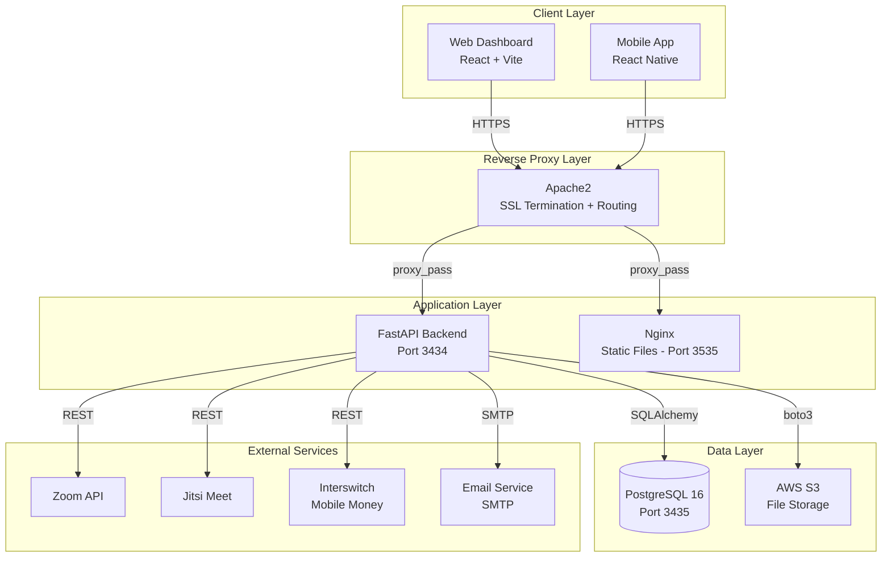

---

## 2. Deployment Architecture

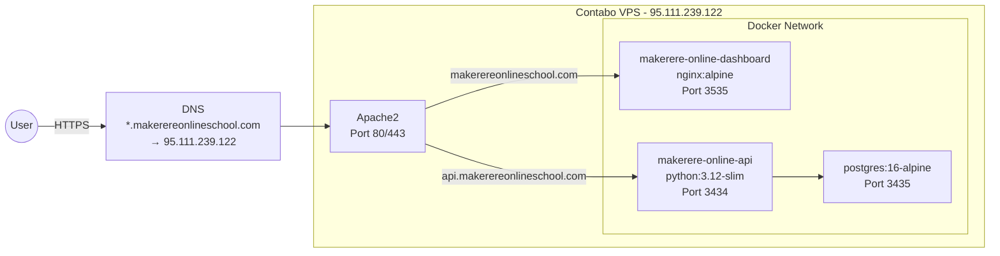

---

## 3. Module Communication Diagram

```mermaid
graph TD
    subgraph "Frontend Modules"
        AUTH_UI[Auth Module<br/>Login / Register]
        SCHOOL_UI[School Management]
        COURSE_UI[Course Management]
        UNIT_UI[Course Unit Management]
        ENROLL_UI[Enrollment Module]
        MATERIAL_UI[Study Materials]
        VIRTUAL_UI[Virtual Learning]
        EXAM_UI[Examination Module]
        CERT_UI[Certification Module]
        PAY_UI[Payment Module]
        TUTOR_UI[Tutoring Module]
        NOTIF_UI[Notification Module]
        REPORT_UI[Reporting Module]
    end

    subgraph "API Routers"
        AUTH_API[/api/auth]
        USERS_API[/api/users]
        SCHOOLS_API[/api/schools]
        COURSES_API[/api/courses]
        UNITS_API[/api/course-units]
        ENROLL_API[/api/enrollments]
        MATERIAL_API[/api/materials]
        VIRTUAL_API[/api/virtual-classes]
        EXAM_API[/api/examinations]
        CERT_API[/api/certificates]
        PAY_API[/api/payments]
        TUTOR_API[/api/tutoring]
        NOTIF_API[/api/notifications]
    end

    AUTH_UI --> AUTH_API
    SCHOOL_UI --> SCHOOLS_API
    COURSE_UI --> COURSES_API
    UNIT_UI --> UNITS_API
    ENROLL_UI --> ENROLL_API
    MATERIAL_UI --> MATERIAL_API
    VIRTUAL_UI --> VIRTUAL_API
    EXAM_UI --> EXAM_API
    CERT_UI --> CERT_API
    PAY_UI --> PAY_API
    TUTOR_UI --> TUTOR_API
    NOTIF_UI --> NOTIF_API
    REPORT_UI --> ENROLL_API
    REPORT_UI --> PAY_API
```

---

## 4. Data Flow — Authentication

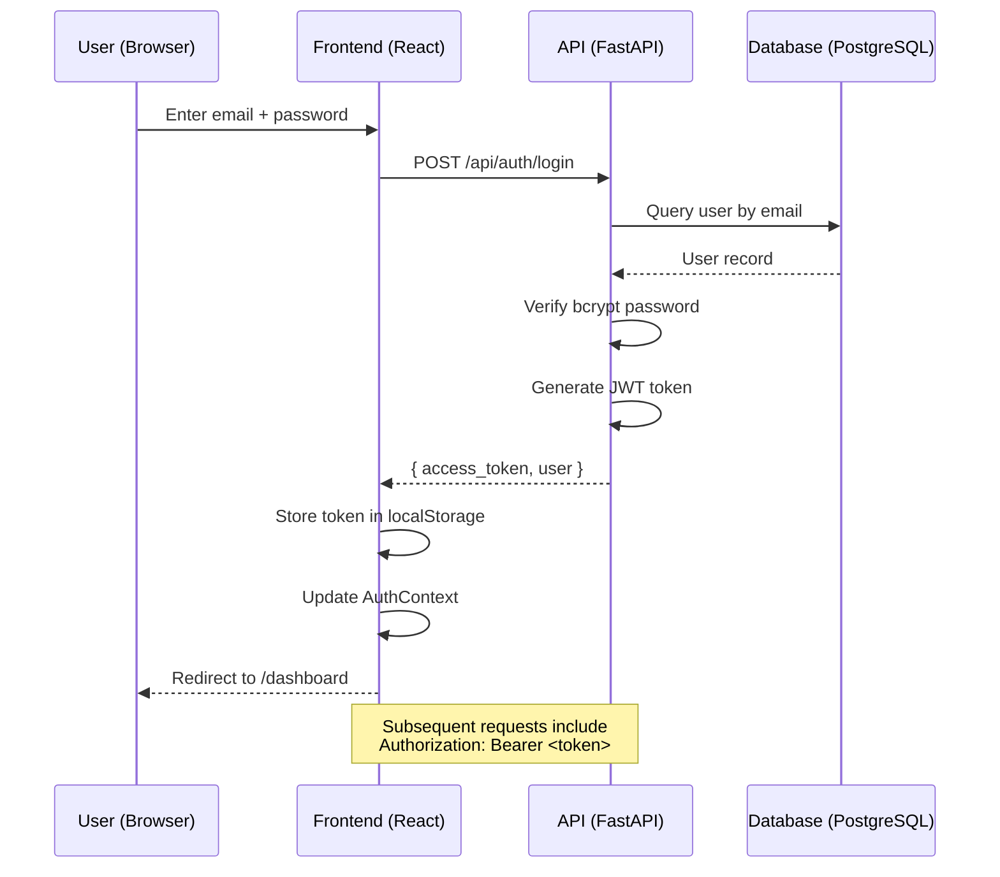

---

## 5. Data Flow — Course Creation

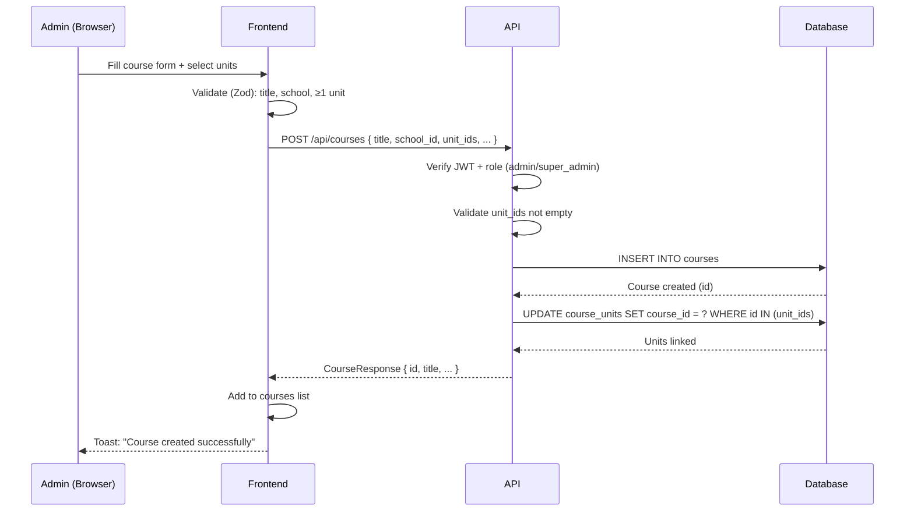

---

## 6. Data Flow — Student Enrollment

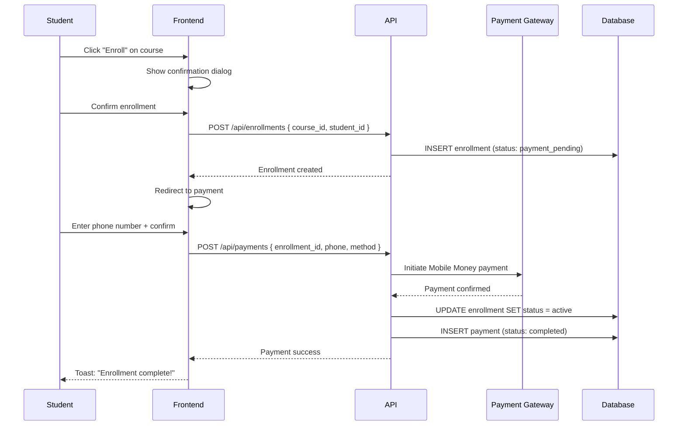

---

## 7. Module Dependency Graph

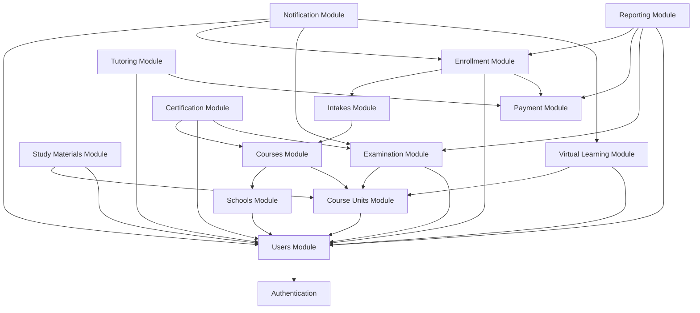

---

## 8. Database Entity Relationship Diagram

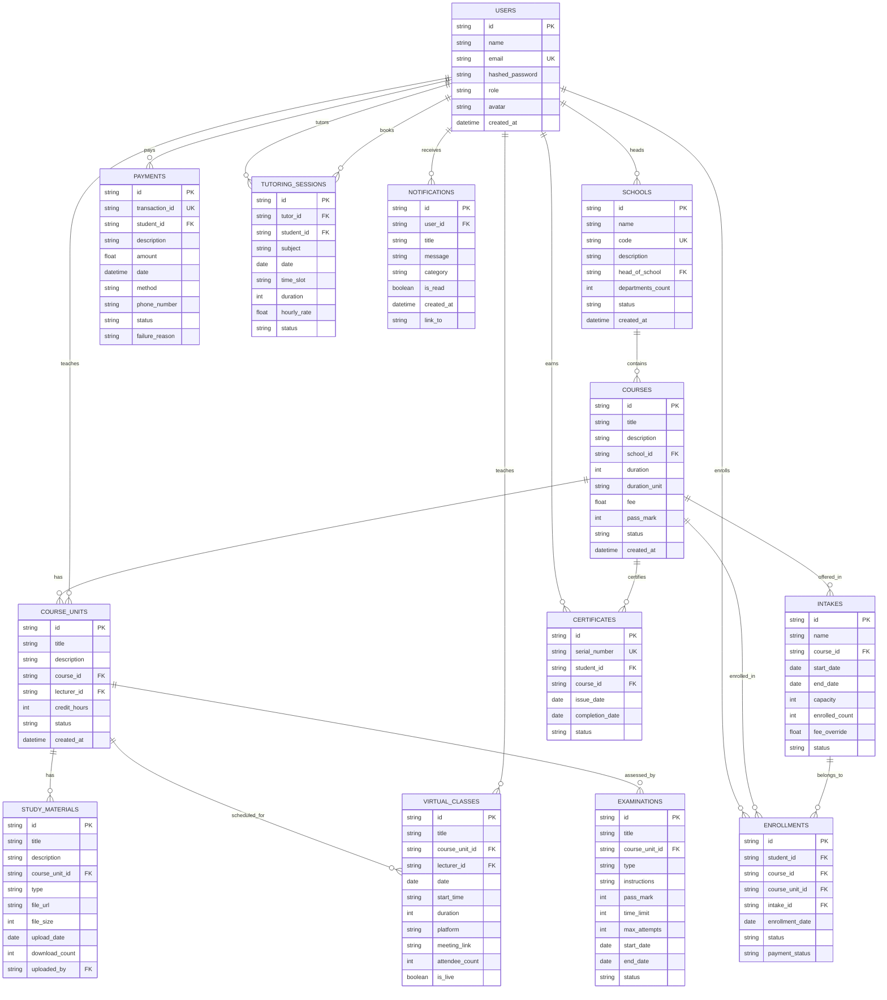

---

## 9. Role-Based Access Control Matrix

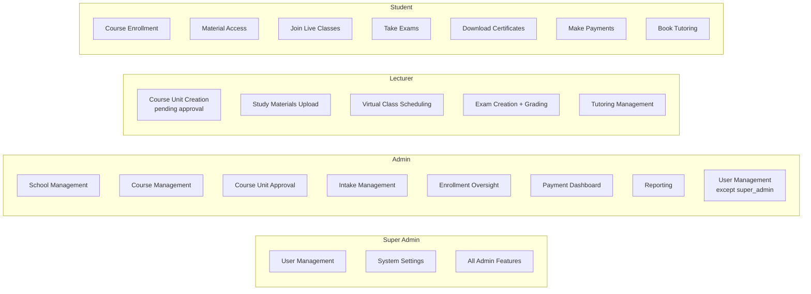

---

## 10. Technology Stack Overview

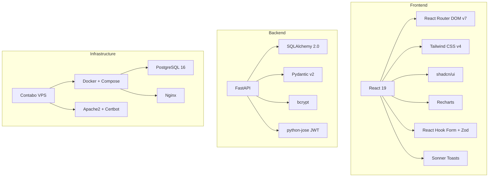

---

## 11. Request Lifecycle

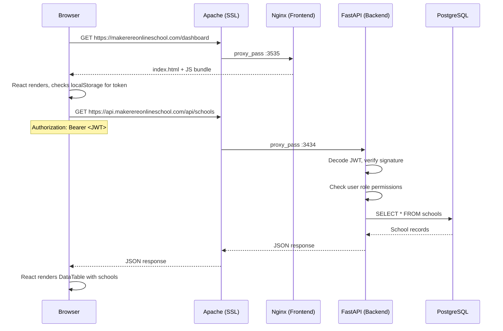

---

## 12. Module Interaction Summary

| Module | Depends On | Provides To |
|--------|-----------|-------------|
| **Authentication** | Users DB | JWT tokens to all modules |
| **User Management** | Authentication | User records to all modules |
| **School Management** | Users (head of school) | School IDs to Courses |
| **Course Management** | Schools, Course Units | Course IDs to Intakes, Enrollment, Certificates |
| **Course Unit Management** | Courses (optional), Users (lecturer) | Unit IDs to Materials, Classes, Exams |
| **Intake Management** | Courses | Intake IDs to Enrollment |
| **Enrollment** | Users, Courses/Units, Intakes, Payments | Access control for Materials, Classes, Exams |
| **Study Materials** | Course Units, Users | Learning content to Students |
| **Virtual Learning** | Course Units, Users, Zoom/Jitsi | Live sessions, Attendance records |
| **Examination** | Course Units, Users | Scores to Certification, Reporting |
| **Certification** | Courses, Users, Exam results | Verifiable certificates |
| **Payment** | Users, Interswitch | Payment status to Enrollment, Tutoring |
| **Tutoring** | Users, Payments | Session records |
| **Notification** | All modules (events) | Alerts to Users |
| **Reporting** | Enrollment, Payments, Exams, Users | Analytics dashboards |

---

*This document uses Mermaid diagrams. View in any Markdown renderer that supports Mermaid (GitHub, VS Code with extension, etc.)*

---

## 13. Class Diagram

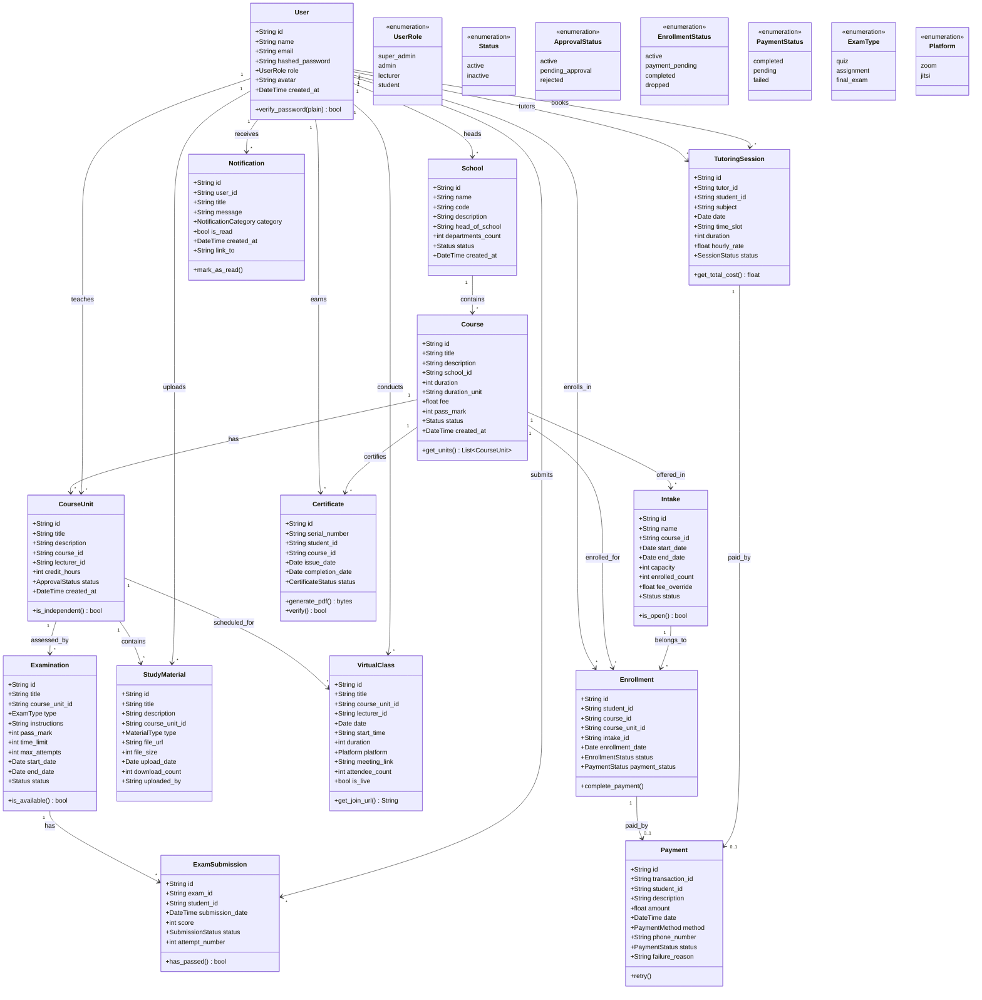
